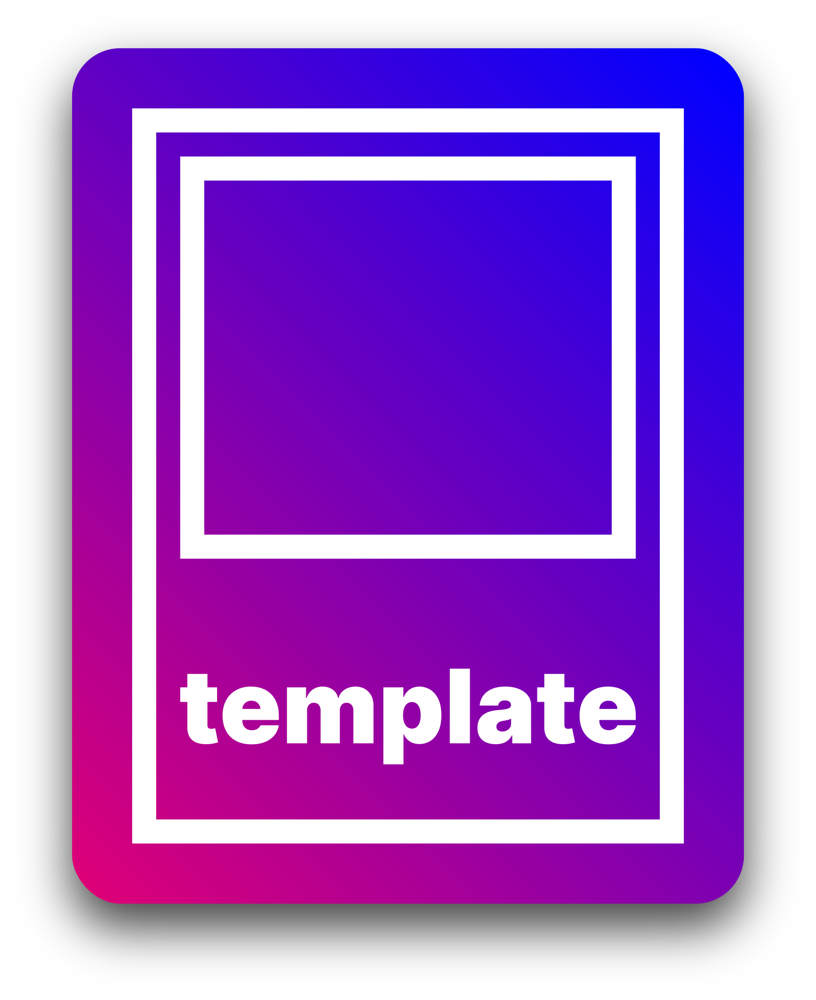

<h1 align="center">
	<a href="https://github.com/pumpncode/template">
		
	</a>
</h1>

<table>
	<thead>
		<tr>
			<th colspan="5">
				<a href="">🌐</a>
			</th>
		</tr>
	</thead>
	<tbody>
		<tr>
			<td data-code="de">
				<strong>Deutsch</strong>
			</td>
			<td data-code="en">
				<a href="../en/readme.md">English</a>
			</td>
			<td rowspan="0">
				<a href="">✍️</a>
			</td>
		</tr>
	</tbody>
</table>

[![stars][2]][1]
[![contributors][4]][3]
[![forks][6]][5]
[![open-issues][8]][7]
[![closed-issues][10]][9]
[![open-prs][12]][11]
[![closed-prs][14]][13]

[![license][16]][15]
[![dependencies][18]][17]
[![dev-dependencies][20]][19]
[![peer-dependencies][22]][21]

[![downloads][24]][23]
[![version][25]][23]
[![node][27]][26]

[![reddit][29]][28]
[![twitter][31]][30]
[![discord][33]][32]

[![website][35]][34]

Dies ist die primäre Vorlagen-Repository für unsere Projekte und der Ursprung aller anderen Vorlagen, weswegen sie nicht direkt für Endprodukte genutzt werden sollte. Sie beinhaltet die grundlegende Struktur und wichtige, sogenannte dotfiles.

*Momentan beinhaltet sie spezifischere Dateien (zum Beispiel eine Rollup-Konfiguration), diese werden aber entfernt sobald wir 2.0.0 erreicht und eine separate Repository dafür haben.*

---

"Unsortierte" Listen in diesem Dokument sind von oben nach unten nach Priorität sortiert, aber sind keine sortierten Markdown-Listen, weil sie keine festgelegten Sequenzen von Schritten kennzeichnen.

Dieses Dokument benutzt in einigen Fällen Emoji-Suffixe um möglicherweise deinen Einrichtungsprozess zu verschnellern, indem es Optionen markiert die du eventuell oder eben nicht berücksichtigen willst:

- Das Suffix 💎 markiert eine **empfohlene** Option oder einen **empfohlenen** zusätzlichen Schritt.
- Das Suffix 🤡 markiert eine mögliche aber **nicht empfohlene** Option.
- Die Suffixe 🍎 (macOS), 🪟 (Windows und [WSL][36]) und 🐧 (Linux) markieren **plattformspezifische** Informationen oder Installationsschritte.

## Einstieg

### Voraussetzungen

Wenn du ein Entwickler bist, hast du folgendes oder funktionierende Alternativen womöglich schon und kannst ruhig zum Bereich [Installation][37] übergehen. Dieser Leitfaden geht davon aus, dass du [Windows][38], Unix oder ein unixoides Betriebssystem ([macOS][39] zum Beispiel) und einen [modernen Browser][40] installiert hast. Dieses Projekt sollte auf allen denkbaren modernen System-Konfigurationen funktionieren, aber am besten solltest du eine fest etablierte und beliebte verwenden.

- [GitHub Account][41] 💎
- [Homebrew][42] 🍎

	```sh
	/bin/bash -c "$(curl -fsSL https://raw.githubusercontent.com/Homebrew/install/HEAD/install.sh)"
	```

- [Git][43]
	- [macOS][44] 🍎
		- Homebrew 💎

			```sh
			brew install git
			```

		- [Direkte Installation][45]
		- [Durch Xcode][46] 🤡
			> Git über Xcode, welches ein Dutzend Gigabyte groß war und eine Stunde zum Einrichten dauerte als ich das letzte Mal nachgesehen habe, zu installieren, ist ein klassischer [Pyrrhussieg][47]. Wenn du allerdings schon Xcode hast, denke ich, dass es okay ist, "deren" Git zu verwenden.
	- [Windows][48] 🪟
	- [Linux][49] 🐧
- [Node.js][50]
	- Installation durch [nvm][51] 💎
		- macOS, Linux & WSL 💎
			1. Installiere [nvm][51]

				```sh
				curl -o- https://raw.githubusercontent.com/nvm-sh/nvm/v0.37.2/install.sh | bash
				```

			2. Installiere die neueste Node.js-Version

				```sh
				nvm install node
				```

		- Windows 🪟
			1. Installiere [nvm-windows][52]
			2. Installiere die neueste Node.js-Version

				```sh
				nvm install latest
				```

	- [Direkte Installation][53]
- [Ein Quellcode-Editor][54]

### Installation

1. Das Template holen
	- Neue Repository durch Template erstellen 💎
		1. Klick auf "Use this template"
			![Screenshot von "Use this template"-Button][55]
		2. Fülle die Einzelheiten ein, markiere "Include all branches" und klick auf "Create repository from template"
			![Screenshot vom "Create a new repository from template"-Bildschirm][56]
		3. Klone die neue Repository

			```sh
			git clone https://github.com/username/my-new-repository.git
			```

	- Neue Repository durch Klonen erstellen 🤡
		> Das würde komplett den Zweck der Template-Funktion von Github verfehlen, weil normale Klone (und Forks) die gesamte Commit-History (und andere Dinge), aber nicht alle Branches kopieren, was normalerweise nicht das ist, was du willst, wenn du ein neues Projekt basierend auf einem Boilerplate erstellst. [Hier mehr dazu][57].
		1. Klone diese Repository in einen neuen Ordner

			```sh
			git clone https://github.com/pumpncode/template.git my-new-repository
			```

2. Einrichtung
	1. Gehe zu deinem neuen Repository-Ordner

		```sh
		cd my-new-repository
		```

	2. Installiere die Abhängigkeiten

		```sh
		npm install
		```

## Nutzung

Das dieses Projekt ein Vorlage ist, hängt die Nutzung ganz davon ab, welches Ziel dein neues Projekt verfolgt. Sobald alles installiert ist, kannst du ausprobieren die Scripts in der [package.json][58] auszuführen, diese nutzen praktisch alle anderen Funktionen dieses Templates.

<!-- Generiert von documentation.js. Änder diese Dokumentation im Source-Code. -->

### helloWorld

Dies ist eine Hello-World-Funktion

#### Beispiele

```javascript
console.log(helloWorld()); // gibt "Hello World!" in der Konsole aus
```

Gibt **[string][59]** "Hello World!" zurück.

## Roadmap

Sieh dir die [derzeitigen Projekte][60] und [offenen Issues][61] für eine Liste von vorgeschlagenen Features und bekannten Fehlern an.

## Mitwirken

Jegliches Mitwirken wird **sehr geschätzt**.

Siehe [contributing.md][62] um loszulegen.

Dieses Projekt hat einen [Verhaltenskodex][63]. Durch das Interagieren mit dieser Repository, stimmst du zu, seinen Bedingungen zu folgen.

## Kontakt

Pumpn Code - [office@pumpn.net][64]

Nano Miratus - [@nnmrts][65] - [nanomiratus@gmail.com][66]

Projekt-Link: [https://github.com/pumpncode/template][67]

## Danksagung

- [unified][68]
- [remark][69]
- [Best-README-Template][70]

## Mitwirkende

| Name             | Website                  | GitHub            | Twitter           |
| ---------------- | ------------------------ | ----------------- | ----------------- |
| **Nano Miratus** | [https://pumpn.net/][71] | [**@nnmrts**][72] | [**@nnmrts**][73] |

## Lizenz

[MIT][74] © [Pumpn Code][75]

[1]: https://github.com/pumpncode/template/stargazers
[2]: https://badgen.net/github/stars/pumpncode/template?color=00f&labelColor=d07&icon=github
[3]: https://github.com/pumpncode/template/graphs/contributors
[4]: https://badgen.net/github/contributors/pumpncode/template?color=00f&labelColor=d07&icon=github
[5]: https://github.com/pumpncode/template/network/members
[6]: https://badgen.net/github/forks/pumpncode/template?color=00f&labelColor=d07&icon=github
[7]: https://github.com/pumpncode/template/issues?q=is%3Aopen+is%3Aissue
[8]: https://badgen.net/github/open-issues/pumpncode/template?color=00f&labelColor=d07&icon=github
[9]: https://github.com/pumpncode/template/issues?q=is%3Aclosed+is%3Aissue
[10]: https://badgen.net/github/closed-issues/pumpncode/template?color=00f&labelColor=d07&icon=github
[11]: https://github.com/pumpncode/template/pulls?q=is%3Aopen+is%3Apr
[12]: https://badgen.net/github/open-prs/pumpncode/template?color=00f&labelColor=d07&icon=github&label=open%20pull%20requests
[13]: https://github.com/pumpncode/template/pulls?q=is%3Aclosed+is%3Apr
[14]: https://badgen.net/github/closed-prs/pumpncode/template?color=00f&labelColor=d07&icon=github&label=closed%20pull%20requests
[15]: https://github.com/pumpncode/template/blob/master/license.md
[16]: https://badgen.net/github/license/pumpncode/template?color=00f&labelColor=d07&icon=github
[17]: https://david-dm.org/pumpncode/template
[18]: https://badgen.net/david/dep/pumpncode/template?color=00f&labelColor=d07&icon=npm&label=dependencies
[19]: https://david-dm.org/pumpncode/template?type=dev
[20]: https://badgen.net/david/dev/pumpncode/template?color=00f&labelColor=d07&icon=npm&label=devDependencies
[21]: https://david-dm.org/pumpncode/template?type=peer
[22]: https://badgen.net/david/peer/pumpncode/template?color=00f&labelColor=d07&icon=npm&label=peerDependencies
[23]: https://npmjs.com/package/@pumpn/template
[24]: https://badgen.net/npm/dm/@pumpn/template?color=00f&labelColor=d07&icon=npm&label=downloads
[25]: https://badgen.net/npm/v/@pumpn/template?color=00f&labelColor=d07&icon=npm&label=version
[26]: https://nodejs.org
[27]: https://badgen.net/npm/node/@pumpn/template?color=00f&labelColor=d07&icon=https%3A%2F%2Fsimpleicons.now.sh%2Fnode-dot-js%2Ffff
[28]: https://reddit.com/r/pumpnuniverse
[29]: https://badgen.net/badge/subreddit/subreddit?color=00f&labelColor=d07&icon=https%3A%2F%2Fsimpleicons.now.sh%2Freddit%2Ffff&label=
[30]: https://twitter.com/PumpnUniverse
[31]: https://badgen.net/badge/twitter/twitter?color=00f&labelColor=d07&icon=twitter&label=
[32]: https://discord.gg/WKvpetegZq
[33]: https://badgen.net/badge/discord/discord?color=00f&labelColor=d07&icon=discord&label=
[34]: https://pumpn.net/code/projects/template
[35]: https://badgen.net/badge/website/website?color=00f&labelColor=d07&icon=data%3Aimage%2Fpng%3Bbase64%2CiVBORw0KGgoAAAANSUhEUgAAABkAAAAMCAQAAAA9%2B97AAAAABGdBTUEAALGPC%2FxhBQAAACBjSFJNAAB6JgAAgIQAAPoAAACA6AAAdTAAAOpgAAA6mAAAF3CculE8AAAAAmJLR0QA%2F4ePzL8AAAAJcEhZcwAACxMAAAsTAQCanBgAAAAHdElNRQflAREIHwyVZyrWAAABCklEQVQoz3WRvUvCURSGDxQEkSEYbdFg%2F4Y2BBLU0tRYLbk4NOQa7uEQQVMEUUMELY1BkDQpSEXRBwSKQxFF0hdUBE%2FL6%2Fldk%2B5dzvue8xzOvccwv92MUWCPKg2awCVdykwyFNW1giTrfPH3JJXNA1uMhMiKSmqUaQZIynsfALDaQkoqmNZ4J45MOTIh5xgzliU%2BSCi97ciMI3Fe5RWNO4W39GD0kgsGmw8%2B51zevfGo8JsX3vlpe36InMl7Mjb4%2F8w5EONZ3qbRT01iiVEWmaXoyK6AQfbl1IkbRh%2BHAKx5z7JDD5S4dnVELFplhtNg9gFuOoasMN6%2BfcNIkw3UAld88sYFO%2BQYjjK%2F7%2FzNJHjJbowAAAAldEVYdGRhdGU6Y3JlYXRlADIwMjEtMDEtMTdUMDg6MzE6MTErMDA6MDDw92QkAAAAJXRFWHRkYXRlOm1vZGlmeQAyMDIxLTAxLTE3VDA4OjMxOjExKzAwOjAwgarcmAAAAABJRU5ErkJggg%3D%3D&label=
[36]: https://docs.microsoft.com/de-de/windows/wsl/about
[37]: #installation
[38]: https://www.microsoft.com/windows
[39]: https://www.apple.com/macos
[40]: https://browsehappy.com/
[41]: https://github.com/join
[42]: https://brew.sh/
[43]: https://git-scm.com/
[44]: https://git-scm.com/download/mac
[45]: https://sourceforge.net/projects/git-osx-installer/
[46]: https://developer.apple.com/xcode/
[47]: https://de.wikipedia.org/wiki/Pyrrhussieg
[48]: https://git-scm.com/download/win
[49]: https://git-scm.com/download/linux
[50]: https://nodejs.org/
[51]: https://github.com/nvm-sh/nvm
[52]: https://github.com/coreybutler/nvm-windows
[53]: https://nodejs.org/en/download/current/
[54]: https://de.wikipedia.org/wiki/Liste_von_Texteditoren
[55]: ../../media/images/screenshot-use-template.png
[56]: ../../media/images/screenshot-create-from-template.png
[57]: https://docs.github.com/en/free-pro-team@latest/github/creating-cloning-and-archiving-repositories/creating-a-repository-from-a-template#about-repository-templates
[58]: ../../package.json
[59]: https://developer.mozilla.org/docs/Web/JavaScript/Reference/Global_Objects/String
[60]: https://github.com/pumpncode/template/projects
[61]: https://github.com/pumpncode/template/issues
[62]: ../../.github/contributing.md
[63]: ../../.github/code-of-conduct.md
[64]: mailto:office@pumpn.net
[65]: https://twitter.com/nnmrts
[66]: mailto:nanomiratus@gmail.com
[67]: https://github.com/pumpncode/template
[68]: https://unifiedjs.com/
[69]: https://github.com/remarkjs
[70]: https://github.com/othneildrew/Best-README-Template
[71]: https://pumpn.net/
[72]: https://github.com/nnmrts
[73]: https://twitter.com/nnmrts
[74]: ../../license.md
[75]: https://pumpn.net/
