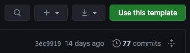
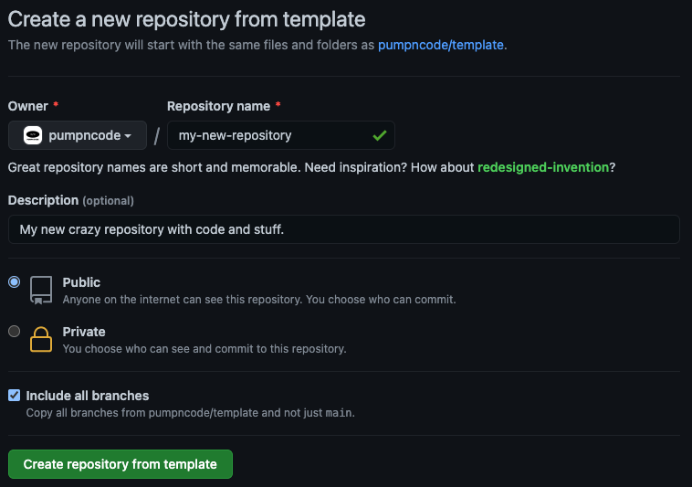

# Einstieg

## Voraussetzungen

Wenn du ein Entwickler bist, hast du folgendes oder funktionierende Alternativen womöglich schon und kannst ruhig zum Bereich [Installation](#installation) übergehen. Dieser Leitfaden geht davon aus, dass du [Windows](https://www.microsoft.com/windows), Unix oder ein unixoides Betriebssystem ([macOS](https://www.apple.com/macos) zum Beispiel) und einen [modernen Browser](https://browsehappy.com/) installiert hast. Dieses Projekt sollte auf allen denkbaren modernen System-Konfigurationen funktionieren, aber am besten solltest du eine fest etablierte und beliebte verwenden.

- [GitHub Account](https://github.com/join) 💎
- [Homebrew](https://brew.sh/) 🍎

	```sh
	/bin/bash -c "$(curl -fsSL https://raw.githubusercontent.com/Homebrew/install/HEAD/install.sh)"
	```

- [Git](https://git-scm.com/)
	- [macOS](https://git-scm.com/download/mac) 🍎
		- Homebrew 💎

			```sh
			brew install git
			```
		
		- [Direkte Installation](https://sourceforge.net/projects/git-osx-installer/)
		- [Durch Xcode](https://developer.apple.com/xcode/) 🤡
			> Git über Xcode, welches ein Dutzend Gigabyte groß war und eine Stunde zum Einrichten dauerte als ich das letzte Mal nachgesehen habe, zu installieren, ist ein klassischer [Pyrrhussieg](https://de.wikipedia.org/wiki/Pyrrhussieg). Wenn du allerdings schon Xcode hast, denke ich, dass es okay ist, "deren" Git zu verwenden.
	- [Windows](https://git-scm.com/download/win) 🪟
	- [Linux](https://git-scm.com/download/linux) 🐧

- [Node.js](https://nodejs.org/)
	- Installation durch [nvm](https://github.com/nvm-sh/nvm) 💎
		- macOS, Linux & WSL 💎
			1. Installiere [nvm](https://github.com/nvm-sh/nvm)

				```sh
				curl -o- https://raw.githubusercontent.com/nvm-sh/nvm/v0.37.2/install.sh | bash
				```

			2. Installiere die neueste Node.js-Version

				```sh
				nvm install node
				````
		
		- Windows 🪟
			1. Installiere [nvm-windows](https://github.com/coreybutler/nvm-windows)
			2. Installiere die neueste Node.js-Version

				```sh
				nvm install latest
				```

	- [Direkte Installation](https://nodejs.org/en/download/current/)
- [Ein Quellcode-Editor](https://de.wikipedia.org/wiki/Liste_von_Texteditoren)

## Installation

1. Das Template holen
	- Neue Repository durch Template erstellen 💎
		1. Klick auf "Use this template"
			
		2. Fülle die Einzelheiten ein, markiere "Include all branches" und klick auf "Create repository from template"
			
		3. Klone die neue Repository

			```sh
			git clone https://github.com/username/my-new-repository.git
			```

	- Neue Repository durch Klonen erstellen 🤡
		> Das würde komplett den Zweck der Template-Funktion von Github verfehlen, weil normale Klone (und Forks) die gesamte Commit-History (und andere Dinge), aber nicht alle Branches kopieren, was normalerweise nicht das ist, was du willst, wenn du ein neues Projekt basierend auf einem Boilerplate erstellst. [Hier mehr dazu](https://docs.github.com/en/free-pro-team@latest/github/creating-cloning-and-archiving-repositories/creating-a-repository-from-a-template#about-repository-templates).
		1. Klone diese Repository in einen neuen Ordner

			```sh
			git clone https://github.com/pumpncode/template.git my-new-repository
			```

2. Einrichtung
	1. Gehe zu deinem neuen Repository-Ordner

		```sh
		cd my-new-repository
		```

	2. Installiere die Abhängigkeiten

		```sh
		npm install
		```
